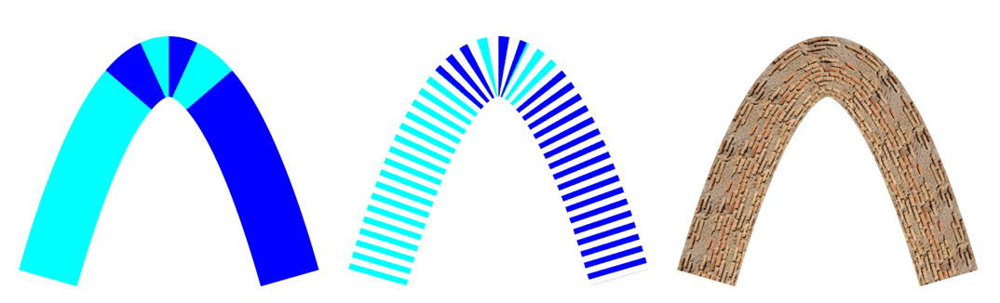

#  GPU-Accelerated Rendering of Vector Strokes with Piecewise Quadratic Approximation

Xuhai Chen, Guangze Zhang, Wanyi Wang, Prof. Juan Cao and Prof. Zhonggui Chen

[Computer Graphics Group of Xiamen University](https://graphics.xmu.edu.cn/)



This repository contains the code implementation for the paper *GPU-Accelerated Rendering of Vector Strokes with Piecewise Quadratic Approximation*, which was accepted at the *CAD/Graphics 2025* conference (Honorable Mention) and published in the journal *Graphical Models*.

## Build
Microsoft Visual Studio 2022 build:

```
mkdir build
cd build
cmake -G "Visual Studio 17 2022" ..
```

## Algorithm Implementation in GPU Shaders
Main algorithms are implemented on shaders. For instance:

- Algorithm 1 Rendering of the Approximate Stroke Region: *quadratic.geom* for triangles generation; *quadratic.frag* for implicit-equation based rendering.

- Algorithm 2 Curvature-Guided Adaptive Subdivision for Quadratic Curves: *quadratic.tesc* for segment number calculation, *quadratic.tese* for computation of where to subdivide;

- Algorithm 3 Newton-based Arc-Length Parameter Computation: *dash_parallel.tese*;

- Algorithm 4 Texture Filling for Approximated Stroke Region: quadratic_texture.frag for Newton iteration on solving the texture coordinate.

## Interaction Notes
- Left-click to add new control points to the current piecewise quadratic curve. The first three points define the initial curve segment. Each additional click adds a new segment that connects smoothly (C¹ continuity) to the previous curve.

- Right-click to start a new piecewise quadratic curve.

- Press the c key to erase the last drawn quadratic curve segment.

- Use the scroll wheel to zoom in or zoom out.

- Press keys 1, 2, or 3 to switch between solid stroke, dashed stroke, and textured stroke modes.

- Press w, s, or g to increase stroke width, dash segment length, and gap length, respectively. Hold Shift while pressing these keys to decrease the corresponding values.

## Vedio Demo


https://github.com/user-attachments/assets/d83d22e9-09a2-4e5c-853f-2c776448ddb8

